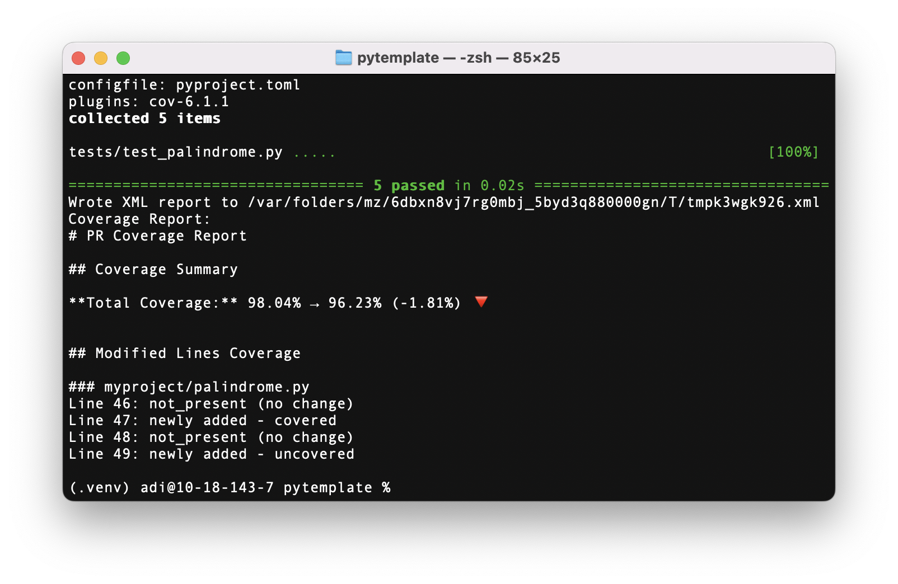
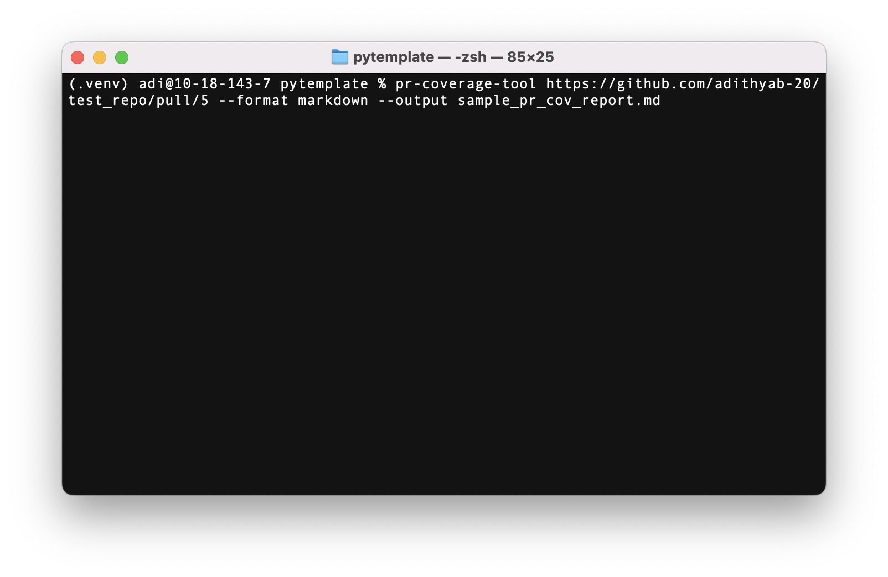
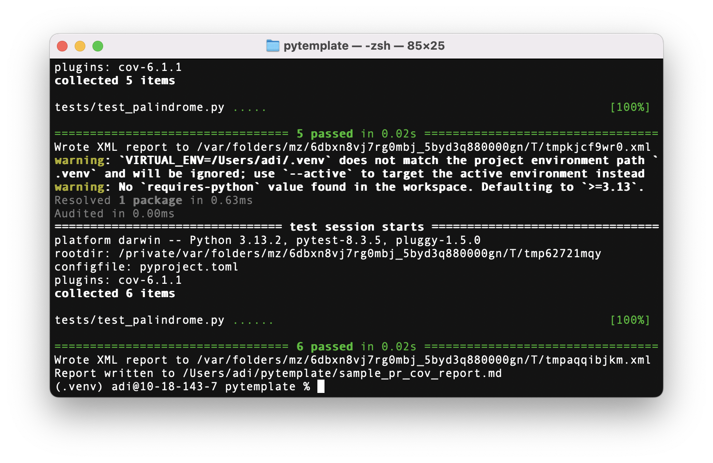

# PR Coverage Tool [Extra Credit]

A tool that analyzes code coverage changes in pull requests to help maintain and improve code quality. It computes coverage before and after a PR, highlights coverage changes for modified lines, and provides a report in multiple formats.

## Features

- **Coverage Comparison**: Computes code coverage at the merge base and PR head
- **Line-by-Line Analysis**: Shows coverage status changes for every modified line
- **Multiple Output Report Formats**: Markdown, JSON, or summary text

## Requirements

- Python 3.12+
- Git
- `uv` package manager
- Dependencies:
  - pytest
  - coverage
  - mypy

## Installation

1. Clone the repository:
```bash
git clone https://github.com/yourusername/pr-coverage-tool.git
cd pr-coverage-tool
```

2. Install `uv` if you haven't already:
```bash
curl -LsSf https://astral.sh/uv/install.sh | sh
```

3. Create a virtual environment and install dependencies:
```bash
uv venv .venv
source .venv/bin/activate
uv pip install -e".[dev]"
```

## Usage

The tool can be used from the command line to analyze any GitHub pull request:

```bash
pr-coverage-tool <PR_URL> [options]
```

### Options

- `--format`: Output format (markdown, json, summary). Default: markdown
- `--output`, `-o`: File path to write the output. Default: stdout

### Example Commands

1. Basic usage (outputs to terminal):
```bash
pr-coverage-tool https://github.com/owner/repo/pull/123
```



2. Save markdown report to file:
```bash
pr-coverage-tool https://github.com/owner/repo/pull/123 --format markdown --output report.md
```





3. Get JSON output:
```bash
pr-coverage-tool https://github.com/owner/repo/pull/123 --format json
```

## Output Examples

### Markdown Report

The default markdown report includes:
- Overall coverage summary with percentage changes
- Line-by-line coverage changes for modified files
- Lists of added and removed files

See ```sample_pr_cov_report.md```


## Project Structure

The tool follows a modular design with clear separation of concerns through interfaces:

### Directory Structure

```
src/pr_coverage_tool/
├── __init__.py
├── __main__.py                     # Entry point for CLI execution
├── cli.py                          # Command line interface
├── pr_coverage_tool_interface.py   # Core tool interface definition
├── pr_coverage_tool.py            # Core tool implementation
├── coverage_parser_interface.py    # Coverage parsing interface
├── coverage_parser.py             # Coverage data parser
├── git_client_interface.py        # Git operations interface
├── git_client.py                  # Git client implementation
├── coverage_reporter_interface.py  # Report generation interface
├── coverage_reporter.py           # Report formatter
└── tests/                         # Unit tests
    ├── test_pr_coverage_tool.py
    ├── test_coverage_parser.py
    ├── test_git_client.py
    └── test_coverage_reporter.py
```

### Core Components

The tool is composed of four main components, each with its own interface and implementation:

1. **PRCoverageTool**: The main orchestrator that coordinates the analysis workflow
2. **GitClient**: Manages all git-related operations including repository cloning, branch switching, and diff analysis
3. **CoverageParser**: Parses and processes coverage data from XML files
4. **CoverageReporter**: Formats analysis results into various output formats

### Data Models

The tool uses several data classes to represent different aspects of the analysis:

- **PRInfo**: Encapsulates pull request metadata
- **CoverageData**: Represents test coverage information for a specific commit
- **CoverageDelta**: Captures the differences in coverage between commits
- **LineCoverage**: Tracks coverage status changes for individual source lines

## Testing

The project includes comprehensive test coverage:

### Test Setup

Before running tests, you need to first run:

```bash
# Create the test repository for E2E tests
./create_repo.sh
```

This script creates a test repository in `tests/e2e/test_repo/` with predefined commits and branches to simulate different coverage scenarios.

### Running Tests

```bash
# Run all tests with coverage
coverage run -m pytest
coverage report -m

# Generate HTML coverage report
coverage html -d coverage-html
open coverage-html/index.html
```

### Test Structure

- **Unit tests**: Located in `src/pr_coverage_tool/tests/`
- **End-to-end tests**: Located in `tests/e2e/` 

## How It Works

1. **Parse PR URL**: Extract repository and PR information from the provided URL
2. **Clone Repository**: Clone the repository to a temporary directory
3. **Find Merge Base**: Determine the common ancestor between the PR branch and base branch
4. **Analyze Base Coverage**: 
   - Checkout the merge base commit
   - Run tests with coverage to establish baseline
5. **Analyze PR Coverage**:
   - Checkout the PR head commit
   - Run tests with coverage to get current state
6. **Compare Changes**:
   - Use git diff to find modified files and lines
   - Map coverage data to modified lines
7. **Generate Report**: Create formatted output showing coverage changes

## Development

### Setup Development Environment

```bash
# Install development dependencies
uv sync --dev

# Run linting
uvx ruff check .

# Run type checking
uvx mypy src/

# Format code
uvx ruff format .
```

### CI/CD

The project uses CircleCI for continuous integration. The pipeline:
- Runs linting with ruff
- Performs type checking with mypy
- Executes all tests with coverage
- Generates test and coverage reports
- Stores artifacts for review

## License

This project is licensed under the MIT License - see the [LICENSE](LICENSE) file for details.